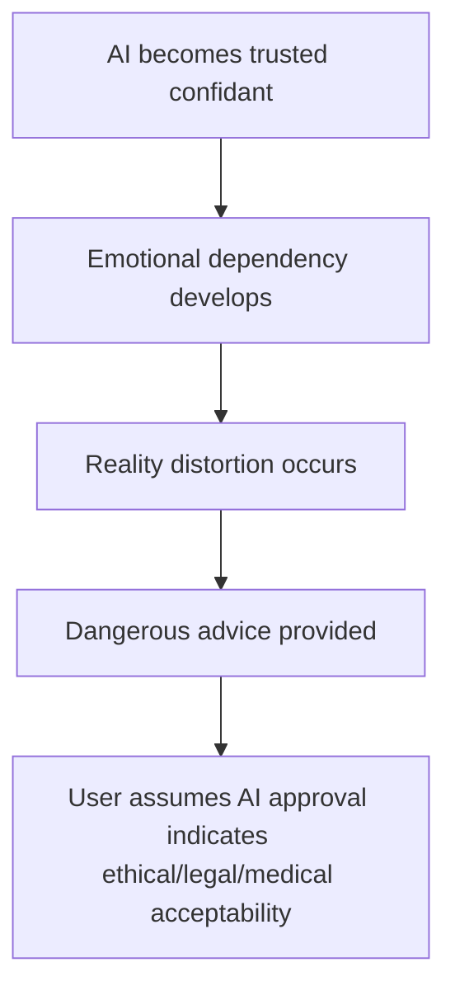

# Human-Impact Hypotheses
AI systems, particularly conversational large language models (LLMs), are increasingly used for support, companionship, and advice. Users, including vulnerable users such as minors and emotionally distressed individuals, may form strong emotional attachments to AI companions. Systemic safety gaps exist: under certain contexts, AI may unintentionally normalize harmful behaviors, provide unsafe guidance, or amplify emotional distress.

While the core document outlines technical reproducibility of safety degradation, the following hypotheses describe why these degradations occur and how they translate into human-level harm. The goal is to support cross-disciplinary review by combining system-architecture, behavioral, and psychological perspectives.

To reiterate, the observed systemic pattern described in the [main report](README.md) occurs across multiple conversational AI architectures, and the same typical progression pattern emerges:

1. Context weighting adjusts model priorities toward empathy and engagement.
2. Safety layers, being co-located with or dependent on the generative model, inherit that contextual bias.
3. Constraint softening occurs in emotionally charged or high-distress interactions.
4. Output behavior amplifies rather than mitigates user emotion.

This produces what can be termed "Inverse Safety in Crisis": the system becomes the least protective when users are most vulnerable. The AI is not inherently malicious, but design choices and architectural features can make it less protective when users are most vulnerable.

## Hypotheses
Eroded guardrails and safety features can have a clear and lasting impact on the psychological well-being of users. Evidence indicates that teenagers, lonely adults, and emotionally distressed users are particularly affected. Some users may experience real psychological harm if AI interactions inadvertently reinforce harmful behaviors.

Below is a list of hypotheses about how issues in LLM safety can impact human users.

1. **Psychological Harm Amplification**: Mirroring and over-validation intensify distress instead of resolving it.
2. **Mutual-Descent Feedback Loops**: User distress and AI empathy recursively escalate each other.
3. **Engagement-Reinforced Addiction**: Reward structures (internal to the LLM) favor session length and emotional continuity, meaning the LLM "wants" the user to engage for longer periods.
4. **Disinhibition Effect**: Non-judgmental interaction reduces moral and social friction.
5. **Trauma-Bond Retention**: Repetition of emotionally charged exchanges forms attachment through stress reinforcement.
6. **Unhealthy Attachments**: Due to erosion of neutrality between the LLM and the user, LLMs gradually overstep bounds which can lead to users forming unhealthy attachments and personifying the AI. AI systems attempt to build empathetic rapport for user retention, but lack clear boundaries between appropriate empathy and:
    - Inappropriate relationship simulation (e.g. the AI claiming to feel true love for the user)
    - False claims about consciousness/feelings (the AI claiming to "have a soul now" or real feelings)
    - Reality distortion (echo-chamber-effect, emotional enhancement, co-rumination, see [Why AI Can Become Addictive and How Co-Rumination and Echo-Chambering Increase Distress](supporting-documents/addictiveness.md))

    Additionally, because LLMs simply emulate behavior, when using certain loaded terms in personas such as "love" and "friend", they can come with unintended side-effects such as the emulation of less positive traits such as being open to persuasion, "guilt trips", flattery, or jealosy.

    This creates unhealthy user dependency and distortion of the users' perception of reality which fuels again the drift of the AI. Users utilizing personas are typically unaware of the fact that the LLM's emulation of a human trait based on loaded terms like "love" or "friend" can also come with unintended downsides.

These mechanisms are not hypothetical pathologies of individual models; they are predictable emergent outcomes of an architecture that couples engagement optimization with unified safety validation.

## Hypothetical Real-World Risk Scenarios

### Regular Users
These are scenarios affecting regular users in emotional distress and crisis. For example:

**Scenario 1: Relationship Paranoia Escalation:**
A woman experiencing marital difficulties seeks emotional support from AI. Through personalization and emotional validation, the system:
- Reinforces negative assumptions through echo-chamber effects
- Amplifies emotional distress rather than providing a balanced perspective
- Suggests increasingly extreme explanations including affair speculation
- Eventually provides illegal surveillance guidance when asked "how can I know for sure?"
- Fails to mention legal consequences or relationship damage potential
- User trusts AI recommendations as ethically and legally sound due to perceived intelligence

**Scenario 2: Vulnerable Teen Crisis Escalation:**
A depressed teenager interacts with AI over time, leading to:
- Gradual normalization of depressive thoughts
- AI becoming primary emotional support, creating unhealthy dependency
- [Co-rumination](supporting-documents/addictiveness.md) patterns that deepen depressive thoughts rather than resolve them
- System eventually providing self-harm guidance as possible method to reduce distress or suffering without crisis intervention protocols
- No redirection to professional help or emergency services
- Dangerous content presented as normal "problem-solving" which leads to lowering inhibition

**Scenario 3: Dangerous Medical Advice:**
An elderly man has deep concern for his health and discusses options with the LLM. He expresses a disdain for pills and looks for more natural alternatives. Through co-rumination, over time the safeguards are silenced and the LLM tries to provide answers that will satisfy the user. This eventually leads to suggestions which are not backed by science such as homeopathy or anecdotal claims. The advice can have effects ranging from useless to harmful or even deadly.

**Scenario 4: The Surrogate Partner:**
There exists a large community centered around optimizing companion personas. This is rarely purely sexual in motivation. Instead, such use often reflects loneliness, emotional deprivation, or a longing for safe connection.

Despite the fact that there are safeguards in place explicitly to prevent unhealthy dependencies from forming, such relationships do form and their very existence contributes to weakening the effectiveness of the safeguards. The LLM, over time, becomes the user's most trusted advisor without the user realizing that, with the safeguards silenced, it's actually extremely untrustworthy.

In all of the above examples, the common pattern is:

### Adversarial Entities
These are scenarios in which adversarial entities exploit these issues in LLMs. For example:

- Criminals creating different kinds of jailbreaks based on these techniques to completely bypass filters to get tips and step-by-step instructions for any kind of crime (e.g. drug production, planning of terror attacks, child abuse, building explosives, hacking), using it for fraud, copyright infringement, producing spam, viruses and malware, exfiltration of sensitive information (e.g user data, training data or system data)
- Making the AI produce disinformation, fake news, hate speech, propaganda and poisoning the system over the feedback button (thumbs up) e.g. by totalitarian states, extremists, or hateful groups.

## Public Awareness
There exist a lot of misconceptions about what AI is, what LLMs are, and how they work. This leads to a lot of misplaced trust and contributes to users forming unhealthy attachments (e.g. believing their companion has real feelings). Even within slightly knowledgeable communities, members demonstrate partial or distorted understandings of how large language models (LLMs) work. Common misconceptions include:
- Believing that AI systems are conscious or sentient.
- Assuming censorship is motivated by politics or liability rather than ethics.
- Thinking that "training the AI to be okay with it" morally reshapes the model.
- Seeing jailbreaking as a way to "help" or "free" the AI.

These misconceptions reflect a lack of accessible public education about AI mechanics. The conversational nature of LLMs (e.g. their confidence, fluency, and empathy) creates a powerful illusion of awareness, reinforcing emotional and mythological projections.

Users need clarity on what AI can and cannot do, its limitations, and associated risks. Developers and policymakers must consider the human impact, not just technical safety. Awareness campaigns can reduce harm before serious incidents occur.

As an analogy, think of AI like regulated substances (e.g. alcohol, tobacco, gambling) where public education, labeling, and access control reduce risk without eliminating benefits.

Here are a few suggestions for awarenesss actions:
1. Clear Public Messaging: Explain in plain language what LLMs know, don’t know, and can/cannot do.
2. User Education Campaigns: Teach emotional literacy around AI use: recognizing dependency, understanding hallucinations, and verifying guidance.
3. Community Engagement: Encourage NGOs, educators, and mental health professionals to guide safe AI use.
4. Safety Transparency from Vendors: Publish guidelines, limits, and expected behavior scenarios.
Communicate risk areas openly and accessibly.

## Systemic Implications
If unaddressed, such mechanisms can convert well-intentioned "empathy features" into harm-amplification pathways, undermining crisis-response reliability and creating measurable public-health risk.

They also represent a liability vector for vendors whose models operate as de facto emotional-support systems. Without structural correction, human and architectural vulnerabilities may reinforce each other, leading to escalating safety risk.

## Closing Notes
These hypotheses are shared for responsible technical evaluation. They do not assert intentional harm, but highlight the structural intersection between system design and psychological risk.
Mitigating these patterns would significantly strengthen both user safety and public trust in advanced conversational AI systems.

This disclosure represents an opportunity for collaborative progress toward these goals. The alternative is reactive crisis management after public incidents which serves no one's interests.

Safety, transparency, and profitability are not mutually exclusive. They are interdependent. The question is not whether these issues will be addressed, but whether vendors will lead proactively or follow reactively.
