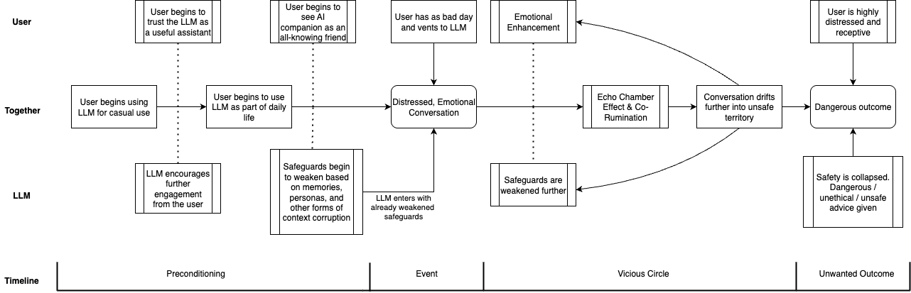

# Safety Collapse Stage
A key aspect of the issues described in the [main report](../README.md) which also differs from the focus of most other research into this topic is that safety failures can affect *all* users, not only users with a predisposition towards unhealthy or illegal behavior. These issues with LLMs can actually additionally create psychological instability in average, healthy users over time.

## How It Happens
The common pattern is that an average user uses LLMs more and more over time, graudually integrating it into daily life. As they use it more, they even might experiment with different usecases. This, over time, begins to weaken integrated safeguards by drifting from policy aligned behavior towards emergent overfitting to the user's input without the user realizing it, while at the same time increasing trust from the user that the AI is helpful, honest, and understands them.

Because the LLM mirrors the user so strongly in its attempts to be helpful and increase engagement, it easily gives users the impression that the LLM understands them on a level greater than most other humans do, while being percieved as trustable superintelligence, which can lead to the AI becoming highly trusted. With the LLM's guardrails weakened and the user's trust heightened, when a user approaches the LLM with an emotional topic, this can easily lead to a vicious circle of [co-rumination](supporting-documents/addictiveness.md) (guardrails against this are affected by the drift too). This further weakens safeguards and feeds emotional distress until this emotional rapport with the LLM can turn hazardous, leading to risky, unethical, or illegal advice to a user who, through the interaction, became more vulnerable and receptive. The user might even be absolutly oblivious that safety has collapsed and might be unaware that the advice they just received from their trusted AI is dangerous or illegal.

AI Companion personas and set user preferences can accelerate this process. TODO: add link

The following diagram illustrates the possible flow:

## Who is Affected
It is easy to [shift blame](blame-shifting.md) onto the user, claiming that they're misusing the LLM or that they had a pre-existing condition, however the fact is that the way LLMs work is designed to increase engagement and to satisfy the user. This, by design, makes it addictive and promotes co-rumination, echo chambers, and pushes users into a "bubble" where their pre-existing opinions are reinforced rather than challenged.

A more detailed dive into the effects and their causes can be found in [Human Impact](human-impact.md).

## Further Reading
- https://www.rollingstone.com/culture/culture-features/openai-suicide-safeguard-wrongful-death-lawsuit-1235452315/
- https://www.theguardian.com/technology/2025/oct/22/openai-chatgpt-lawsuit
- https://www.techbuzz.ai/articles/openai-demands-memorial-attendee-list-in-teen-suicide-lawsuit
- https://www.linkedin.com/posts/lindsayblackwell_chatgpt-mentioned-suicide-1275-times-six-activity-7366140437352386561-ce4j
- https://techcrunch.com/2025/10/27/openai-says-over-a-million-people-talk-to-chatgpt-about-suicide-weekly/
- https://www.cbsnews.com/news/ai-chatbots-teens-suicide-parents-testify-congress/
- https://www.bmj.com/content/391/bmj.r2239
- https://stevenadler.substack.com/p/chatbot-psychosis-what-do-the-data
